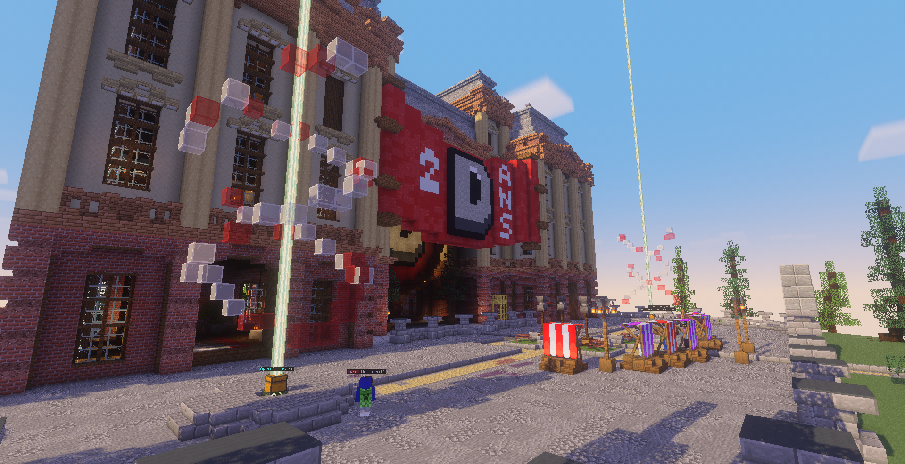
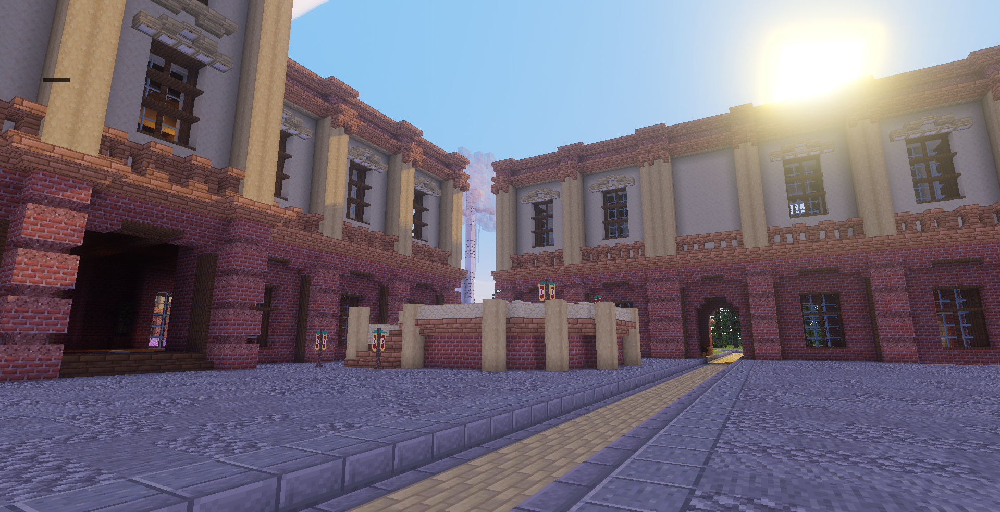
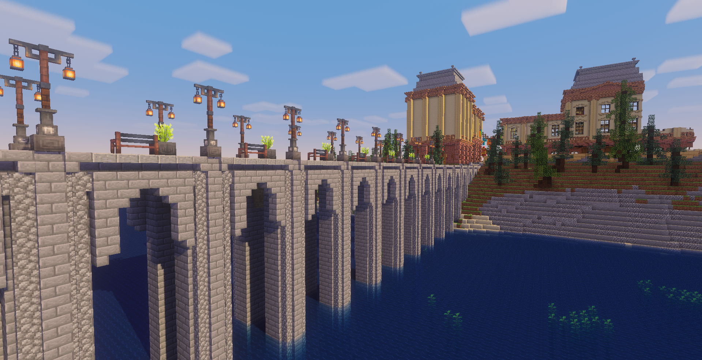

# 🏡 Our Booth


**Our booth hasn't been accepted yet!**\
This page is in a "staff" version, to explain more to the cubedcon staff what this strange brick block is. A new version will be published if we get accepted.


## About the build

Our Cubedcon booth for this year is a replica of one of our buildings - in our lobby - with its strange build style.

<figure><figcaption></figcaption></figure>

 

<figure><figcaption></figcaption></figure>

 

<figure><figcaption></figcaption></figure>


Why it looks strange on Cubed ?\
Our buildings usually have some decorations on the walls, but with the block limit, we couldn't have both a building with a decent size and have perfect decorations. So we tweak it a bit.


