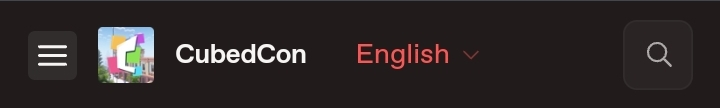

# 🏠 Bienvenue !

Hey @everyone ! Nous sommes **DEMOCRAFT**, un serveur minecraft français qui permet au joueurs de toutes les éditions du jeu à jouer ensemble - ajouté à la magie du ressource pack


**DEMOCRAFT EST UN SERVEUR FRANÇAIS**

Cela veux dire que le serveur est globalement traduit en français et est hébergé en Europe (avec un ping potable pour nos amis canadiens). 
Si vous voulez directement jouer, vous pouvez donc vous diriger vers notre [site web](https://democraft.fr) et jeter un œil à notre [wiki](https://wiki.democraft.fr). Ou si vous préférez, suivez ce guide spécialement créé pour la CubedCon, plus simple, plus rapide et plus efficace !


Sur ce site Web, vous allez pouvoir en savoir plus sur notre serveur, son concept, ses modes de jeux, ses "open worlds", appelés aussi *planètes*, avec un petit tour sur nos valeurs et quelques ressources à propos de notre serveur :D

Vous pouvez utiliser le **boutton hamburger** 🍔 pour naviguer sur le site et changer de langue - pour l'instant uniquement vers l'anglais.
