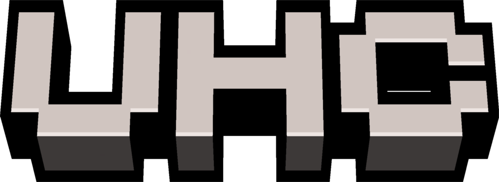

# Welcome to DEMOCRAFT
Hi! First, I'm glad that you take up some time to look about our server. On this website, you will found some informations about our concept, our games and our uniques features !

!!! example "We'r in Devlopment!"

    **DEMOCRAFT is still in devlopment!**
    A lot of features and gammes are comming in the future, and you may experience bugs
    If you want to participate to the server, dont hesitate to go on our [Discord](https://dsc.gg/democraft) to report bugs or suggest new functionalities !

!!! info "If you'r not french"

    This server is mainly a french server.
    Even if we work on translation and really encourage foreing people to join our comunity, the translation system is not working on every game and is not aviable, at this time, on gui.
 
# About Us
DEMOCRAFT is a minigames crossplay server, which was originally open to crack players (which is dangerous to do now with the new EULA), which ame to be unique & accesible
We use a custom resource pack, again on bedrock and java, to improve the player's experience and maker the server even more fun!

# Our games

-   

    ---

    Install [`mkdocs-material`](#) with [`pip`](#) and get up
    and running in minutes

    [:octicons-arrow-right-24: Getting started](#)

-   

    ---

    Focus on your content and generate a responsive and searchable static site

    [:octicons-arrow-right-24: Reference](#)

-   

    ---

    Change the colors, fonts, language, icons, logo and more with a few lines

    [:octicons-arrow-right-24: Customization](#)

-   

    ---

    Material for MkDocs is licensed under MIT and available on [GitHub]

    [:octicons-arrow-right-24: License](#)

-   

    ---

    Change the colors, fonts, language, icons, logo and more with a few lines

    [:octicons-arrow-right-24: Customization](#)

-   

    ---

    Material for MkDocs is licensed under MIT and available on [GitHub]

    [:octicons-arrow-right-24: License](#)

# What's in DEMOCRAFT
